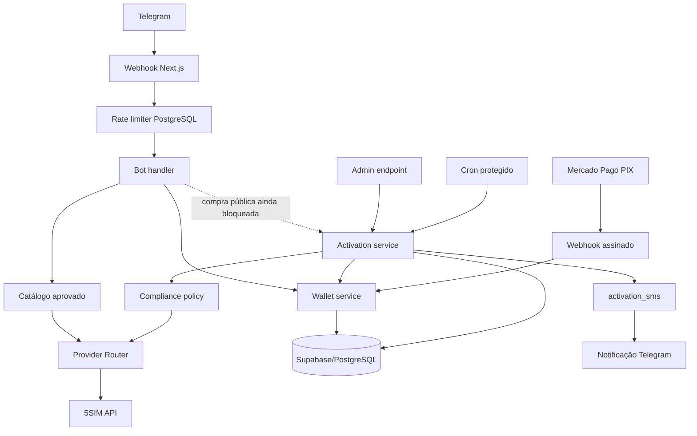

# Arquitetura do CENTRAL SMS MVP

## Decisão do MVP

O backend é a fonte de verdade. O Telegram é apenas a interface de conversa. O primeiro adapter é a 5SIM, porque a API atual oferece catálogo público, ativação curta (`activation`), número por período (`hosting`), consulta, cancelamento e finalização em uma interface única. O `ProviderRouter` permite adicionar SMSPool depois sem alterar carteira, Telegram ou pagamentos.

Compras reais nascem desligadas. Um produto só pode ser vendido se passar simultaneamente por:

1. `PURCHASES_ENABLED=true`;
2. moeda/câmbio configurados;
3. estoque revalidado no provider;
4. `service_policies.enabled=true`;
5. categoria de risco não bloqueada.

## Fluxo

## Tipos de número

### ONE_TIME_SMS

Uma ativação de curta duração para receber o SMS associado a um serviço permitido. Após receber o SMS, a ativação pode sair do ciclo de polling.

### TEMPORARY_HOSTING

Número disponibilizado por um período. Pode receber mais de um SMS durante a vigência. Por isso o sistema:

- persiste cada SMS em `activation_sms`;
- deduplica por ID do provider ou fingerprint SHA-256;
- continua o polling após o primeiro SMS;
- notifica apenas mensagens novas;
- encerra somente em estado terminal do provider/expiração.

## Dados principais

- `app_users`: vínculo Telegram → usuário interno.
- `wallets`: saldo materializado em centavos.
- `wallet_transactions`: ledger idempotente.
- `service_policies`: allowlist de produtos e classificação de risco.
- `activations`: ordem/ativação e último SMS para consulta rápida.
- `activation_sms`: histórico completo de SMS.
- `payments`: PIX e estado local.
- `rate_limit_buckets`: limites atômicos por janela.
- `audit_logs`: trilha administrativa/operacional.

## Segurança operacional

- segredos somente no servidor;
- `anon` e `authenticated` sem privilégios nas tabelas do MVP;
- RPCs sensíveis revogadas de `PUBLIC`, `anon` e `authenticated`, liberadas apenas para `service_role`;
- carteira mutada por RPC atômica/idempotente;
- webhook Telegram protegido por `secret_token`;
- webhook Mercado Pago autenticado por `x-signature`/HMAC;
- endpoints admin protegidos por token;
- rate limit persistente no PostgreSQL;
- compras públicas desligadas até confirmação comercial do provider.

## Ordem de produção

1. Subir Supabase dedicado e aplicar/revisar `supabase/schema.sql`.
2. Configurar Telegram e validar `/start`, `/saldo` e rate limit.
3. Consultar catálogo bruto apenas como admin.
4. Revisar serviços e popular a allowlist.
5. Confirmar formalmente moeda e permissão comercial/revenda do provider.
6. Inserir saldo de teste via endpoint admin.
7. Habilitar compra somente em ambiente controlado e testar valor mínimo.
8. Ativar PIX e validar webhook/idempotência.
9. Adicionar SMSPool como segundo adapter/fallback.
10. Construir o painel administrativo.
